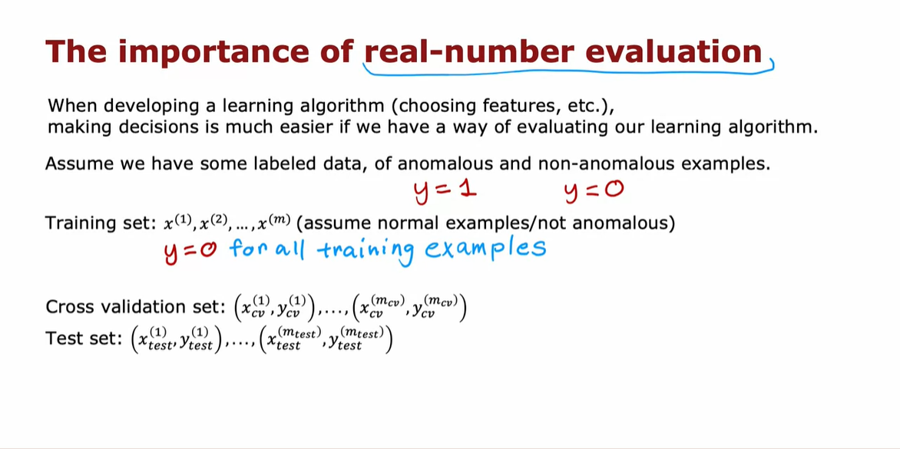

# Academic Notes on Anomaly Detection Algorithm

## Introduction to Anomaly Detection

- **Definition:** Anomaly detection is an unsupervised learning algorithm designed to identify unusual or anomalous events within an unlabeled dataset of normal occurrences.
  
- **Example:** A practical application of anomaly detection is in aircraft engine manufacturing, where ensuring reliability is crucial. The algorithm analyzes features such as heat generation (x1) and vibration intensity (x2) to detect any anomalies in newly manufactured engines.

## Understanding the Problem

- **Data Features:** After an aircraft engine is manufactured, various features (e.g., x1 and x2) are computed, representing characteristics like heat and vibration.

- **Data Distribution:** Since defective engines are rare, the dataset primarily consists of normal engine behavior. The challenge is to determine if a new engine, represented by feature vector Xtest, is similar to the ones in the training set.

## Anomaly Detection Algorithm Process

1. **Data Representation:**
   - Plot the examples (data points) of normal engine behavior based on features x1 and x2.

2. **Identification of Anomalies:**
   - If a new engine's feature vector Xtest deviates significantly from the established data distribution, it is flagged as a potential anomaly.

3. **Density Estimation:**
   - Anomaly detection commonly employs density estimation to model the probability distribution of features in the training set.

4. **Probability Computation:**
   - For a new test example Xtest, compute the probability (p of Xtest) based on the learned model.

5. **Anomaly Decision:**
   - If p of Xtest is less than a predefined threshold (epsilon), flag the example as an anomaly; otherwise, consider it normal.

## Applications of Anomaly Detection

1. **Fraud Detection:**
   - Used in online platforms to detect anomalous user activities, prompting additional security measures without automatically blocking accounts.

2. **Manufacturing Quality Control:**
   - Applied in various manufacturing processes to identify anomalies in products such as aircraft engines, printed circuit boards, smartphones, and more.

3. **Computer Systems Monitoring:**
   - Monitors machines in clusters and data centers by analyzing features like memory usage, disk accesses, and CPU load to identify potential issues or security threats.

4. **Telecommunications:**
   - Implemented in the telecom industry to detect unusual behavior in cell towers, facilitating prompt maintenance for improved network coverage.

5. **Financial Transactions:**
   - Utilized to identify fraudulent financial transactions by detecting patterns that deviate from normal spending behavior.

## Importance and Practical Use

- **Widespread Application:** Despite limited discussion, anomaly detection is widely employed in various industries, demonstrating its versatility and effectiveness.

- **Personal Experience:** The speaker shares personal experiences applying anomaly detection in telecommunications and finance, emphasizing its practical utility.

## Gaussian Distribution in Anomaly Detection

- **Essential Component:** Gaussian distribution is crucial for modeling the probability distribution (p of x) in anomaly detection algorithms.

- **Next Steps:** Subsequent notes will delve into the details of Gaussian distributions and guide the process of building and implementing these algorithms for effective anomaly detection.

# Gaussian Distribution and Anomaly Detection

## Gaussian Distribution Overview

- **Gaussian Distribution:** Also known as the normal distribution, it is a probability distribution characterized by a bell-shaped curve. The curve is defined by two parameters: mean (Mu) and variance (sigma squared).

- **Probability of x:** The probability of a random variable x following a Gaussian distribution is given by the formula:
  \[ p(x) = \frac{1}{\sqrt{2\pi}\sigma} e^{-(x - \mu)^2/(2\sigma^2)} \]

- **Interpretation:** The probability density function \(p(x)\) represents the likelihood of observing a specific value of x. The bell-shaped curve illustrates the distribution of a large number of samples drawn from this distribution.

## Effect of Changing Mu and Sigma

1. **Standard Gaussian Distribution (Mu = 0, Sigma = 1):**
   - Centered at zero with a standard deviation of one.
   - A common reference for comparison.

2. **Reduced Sigma (Sigma = 0.5):**
   - Thinner curve due to a smaller standard deviation.
   - Taller curve compensates for the reduced width.

3. **Increased Sigma (Sigma = 2):**
   - Wider distribution with a larger standard deviation.
   - Shorter curve to maintain a total area under the curve equal to one.

4. **Change in Mu (Mu = 2, Sigma = 0.5):**
   - Shifts the center of the distribution to the right while maintaining the standard deviation.
   

## Application to Anomaly Detection

- **Anomaly Detection Dataset:** Given a dataset of \(m\) examples with a single feature \(x\), the goal is to estimate parameters Mu and Sigma squared for a Gaussian distribution.

- **Estimation Formulas:**
   - \[ \mu = \frac{1}{m} \sum_{i=1}^{m} x^{(i)} \]
   - \[ \sigma^2 = \frac{1}{m} \sum_{i=1}^{m} (x^{(i)} - \mu)^2 \]
   
- **Maximum Likelihood Estimates:** These formulas provide estimates for Mu and Sigma squared and are technically known as maximum likelihood estimates.

- **Anomaly Decision:** Given an example \(x_{\text{test}}\):
   - If \(p(x_{\text{test}}) < \epsilon\), flag it as an anomaly.
   - If \(p(x_{\text{test}}) \geq \epsilon\), consider it normal.

## Handling Multiple Features

- **Extension to Multiple Features:** In practical applications, there are usually multiple features (\(n\) features).
  
- **Sophisticated Anomaly Detection:**
   - The principles learned from a single Gaussian distribution can be extended to handle multiple features.
   - Calculate Mu and Sigma for each feature independently.

- **Multivariate Gaussian Distribution:** Utilize a multivariate Gaussian distribution to model the joint probability of multiple features. The extension involves using a covariance matrix in addition to Mu and Sigma.

- **Next Steps:** The next pdf will explore the application of Gaussian distribution to more sophisticated anomaly detection algorithms, considering scenarios with multiple features.

# Anomaly Detection Algorithm: Building and Evaluating

## Overview

In building an anomaly detection algorithm, we aim to identify anomalies in a dataset. The algorithm is based on the Gaussian distribution and involves the following steps:

### Step 1: Choose Features

1. **Training Set (x1 through xm):**
   - Each example \(x\) has \(n\) features.
   - Example: In aircraft engine manufacturing, features could include heat and vibrations.

### Step 2: Density Estimation

2. **Model for \(p(x)\):**
   - Assume features are statistically independent (though the algorithm can work even if they aren't).
   - Probability \(p(x)\) modeled as the product of individual feature probabilities:
     \[ p(x) = \prod_{j=1}^{n} p(x_j) \]

   - Each feature \(x_j\) is modeled by a Gaussian distribution:
     \[ p(x_j) = \frac{1}{\sqrt{2\pi}\sigma_j} e^{-\frac{(x_j - \mu_j)^2}{2\sigma_j^2}} \]
     
### Step 3: Parameter Estimation

3. **Estimate Parameters (\(\mu_j\), \(\sigma_j^2\)):**
   - \(\mu_j\) is the average of feature \(x_j\) over all examples.
   - \(\sigma_j^2\) is the average squared difference between \(x_j\) and \(\mu_j\).

   \[ \mu_j = \frac{1}{m} \sum_{i=1}^{m} x_j^{(i)} \]

   \[ \sigma_j^2 = \frac{1}{m} \sum_{i=1}^{m} (x_j^{(i)} - \mu_j)^2 \]

### Step 4: Anomaly Detection

4. **Decision Rule:**
   - Given a new example \(x_{\text{test}}\):
     - Compute \(p(x_{\text{test}})\) using the product of individual feature probabilities.
     - If \(p(x_{\text{test}}) < \epsilon\), flag as an anomaly.
   
## Parameter Choices

- **Choosing Features:**
   - Select features believed to indicate anomalous behavior.

- **Choosing \(\epsilon\):**
   - \(\epsilon\) is a threshold to determine when an example is flagged as anomalous.
   - Typically chosen based on cross-validation on a labeled validation set.

## Evaluation

- **How to know if the algorithm is working well?**
   - Use labeled data (with anomalies marked) to evaluate algorithm performance.
   - Metrics:
     - True Positive (TP), False Positive (FP), False Negative (FN), True Negative (TN).
     - Precision, Recall, F1 Score.
     - Adjust \(\epsilon\) to balance precision and recall based on application requirements.

### Example Evaluation

- **Parameters:**
   - \( \epsilon = 0.02 \)

- **Test Examples:**
   - \(x_{\text{test}_1}\): \(p(x_{\text{test}_1}) \approx 0.4\) (Not flagged as anomaly)
   - \(x_{\text{test}_2}\): \(p(x_{\text{test}_2}) \approx 0.0021\) (Flagged as anomaly)

- **Conclusion:**
   - Algorithm correctly identifies \(x_{\text{test}_2}\) as an anomaly and ignores \(x_{\text{test}_1}\).
   

## Next Steps

In the next pdf, we'll explore parameter tuning, choosing an appropriate \(\epsilon\), and refining the anomaly detection system for optimal performance.
 
 
 
 
 
 
 
 
# Practical Tips for Anomaly Detection System Development

Developing an effective anomaly detection system requires careful consideration and evaluation throughout the development process. Here are some practical tips to enhance the efficiency and performance of your anomaly detection algorithm:

## 1. Real Number Evaluation

* **Continuous Evaluation:** Constantly evaluate the system as it evolves. This ongoing assessment allows for quick decision-making and facilitates timely improvements.
* **Parameter Tuning:** Experiment with different features and parameter values, such as epsilon, to optimize the algorithm. Real number evaluation simplifies the decision-making process regarding feature changes or parameter adjustments.
    

## 2. Integration of Labeled Data

* **Labeling Anomalies:** Incorporate labeled data, including a small set of previously identified anomalies. Assign labels (y=1) to known anomalies and (y=0) to normal instances.
* **Cross-Validation Set:** Create a cross-validation set (x_cv, y_cv) with examples of both anomalies (y=1) and normal instances (y=0). This set aids in tuning parameters like epsilon.
* **Test Set:** Form a separate test set for further evaluation. Include anomalies and normal instances to assess the algorithm's performance on unseen data.

## 3. Dataset Division for Training, Cross-Validation, and Test

* **Example Division:** Divide the dataset into a training set, a cross-validation set, and a test set.
    - Training Set: 6,000 normal engines.
    - Cross-Validation Set: 2,000 normal engines and 10 known anomalies.
    - Test Set: 2,000 normal engines and 10 anomalies.
* **Algorithm Training:** Train the algorithm on the training set, fitting Gaussian distributions to normal instances.
* **Parameter Tuning:** Use the cross-validation set to fine-tune parameters like epsilon based on anomaly detection performance.
* **Evaluation:** Assess the algorithm on the test set to identify anomalies and measure any misclassifications of normal instances.

## 4. Test Set Alternatives

* **Limited Data Scenario:** In situations with limited anomaly examples, consider an alternative where the test set is not used.
    - Use the remaining data (4,000 normal engines and anomalies) for cross-validation.
    - Tune parameters and features based on cross-validation results.
    - Be cautious about potential overfitting to the cross-validation set.

## 5. Evaluation Metrics for Skewed Distributions

* **Skewed Data Handling:** When dealing with highly skewed data distributions (few anomalies compared to normal instances), consider alternative evaluation metrics.
* **Metrics to Consider:** True positive, false positive, false negative, true negative rates, precision, recall, or F1 score. These metrics offer insights into the algorithm's ability to identify anomalies amidst predominantly normal instances.

## 6. Anomaly Detection vs. Supervised Learning

* **Unsupervised Learning:** Anomaly detection is primarily an unsupervised learning approach, relying on unlabeled data for training. Labeled anomalies aid in evaluation and parameter tuning.
* **Supervised Learning Consideration:** Despite having labeled examples, using a purely supervised learning algorithm may not be preferable due to the scarcity of anomaly instances and potential data imbalance.

By incorporating these tips into your anomaly detection system development, you can enhance its robustness, optimize parameters, and effectively identify anomalies in real-world applications.
 
 
 
 
 
 
 
 
 
 
 
 
 

# Choosing Between Anomaly Detection and Supervised Learning

Deciding between anomaly detection and supervised learning depends on the nature of your dataset, specifically the number of positive examples (y=1) and negative examples (y=0). Here are some considerations to help guide your choice:

## 1. Anomaly Detection

* **Small Number of Positive Examples:**
  - Suitable when you have a very limited number of positive examples (0-20 is common).
  - Positive examples are mainly used in the cross-validation and test sets for parameter tuning and evaluation.

* **Diverse Anomalies:**
  - Appropriate when there are many different types of anomalies or positive examples.
  - If new types of anomalies may emerge, making it challenging to cover all possibilities with a small set of positive examples.

* **Modeling Normal Examples:**
  - Focuses on modeling normal (negative) examples (y=0) and flags anything deviating significantly from normal as an anomaly.

## 2. Supervised Learning

* **Larger Number of Positive Examples:**
  - More applicable when you have a relatively larger number of positive examples.
  - Supervised learning assumes that future positive examples are likely to be similar to those in the training set.

* **Similarity to Training Set:**
  - Effective when positive examples in the training set are representative of possible future positive instances.
  - Assumes that the distribution of positive examples in the future will be similar to the distribution observed in the training set.

## Choosing Based on Application

* **Examples:**
  - **Financial Fraud Detection (Anomaly Detection):**
    - Many different ways individuals attempt fraud, and new forms emerge frequently.
  - **Email Spam Classification (Supervised Learning):**
    - Types of spam emails may vary, but they often share common characteristics over time.

* **Manufacturing Defect Detection:**
  - **Anomaly Detection:**
    - Identifying new, previously unseen defects in products.
  - **Supervised Learning:**
    - Detecting known defects based on a set of labeled examples.

* **Security Monitoring:**
  - **Anomaly Detection:**
    - Detecting unusual behavior in machines that may indicate a hack.
  - **Supervised Learning:**
    - Used less frequently due to the constantly evolving nature of hacking techniques.

* **Weather Prediction (Supervised Learning):**
  - Limited types of weather conditions, making it suitable for supervised learning.

* **Medical Diagnosis (Supervised Learning):**
  - Predicting diseases based on known symptoms observed in labeled patient data.

## Summary

* **Anomaly Detection:**
  - Ideal for scenarios with few positive examples and diverse anomalies.
  - Effective when anticipating new and unpredictable forms of anomalies.

* **Supervised Learning:**
  - Suitable when a larger number of positive examples is available.
  - Assumes future positive instances will be similar to those in the training set.

Understanding the characteristics of your data and the potential diversity of anomalies will help you make an informed decision between anomaly detection and supervised learning for your specific application.

# Feature Tuning for Anomaly Detection

When building an anomaly detection algorithm, the choice of features is crucial for optimal performance. Unlike supervised learning, where the algorithm can adapt to various features, anomaly detection relies on unlabeled data, making it harder for the algorithm to determine which features are relevant. Here are practical tips for tuning features in anomaly detection:

## 1. Aim for Gaussian Features

* **Plotting Histograms:**
  - Use histograms to visualize the distribution of your features.
  - A Gaussian (bell-shaped) distribution is desirable for effective anomaly detection.

* **Transformation Techniques:**
  - If a feature's histogram is non-Gaussian, consider transformations.
  - Examples include logarithmic transformation (log(X)), square root (sqrt(X)), and power transformations (X^c).
  - Experiment with different transformation parameters (e.g., c) to achieve a more Gaussian distribution.

* **Ensure Consistency:**
  - Apply the same transformations to features across the training, cross-validation, and test sets.

## 2. Feature Transformation in Jupyter Notebook

* **Interactive Exploration:**
  - Use Jupyter Notebook for interactive exploration and transformation of features.
  - Experiment with various transformation parameters in real-time.

* **Example in Notebook:**
  - Visualize histograms for different transformations (e.g., log(X), sqrt(X), X^c).
  - Observe the impact on the distribution and choose transformations that make the data more Gaussian.

* **Consistent Transformation:**
  - Implement the chosen transformations on your features and maintain consistency across datasets.

## 3. Error Analysis for Improvement

* **Evaluate Model Performance:**
  - Train the anomaly detection model and assess its performance on the cross-validation set.

* **Identify Misclassified Anomalies:**
  - If anomalies are not well-detected, conduct an error analysis.
  - Identify examples where the algorithm fails to recognize anomalies.

* **Create New Features:**
  - Introduce new features that could better distinguish anomalies.
  - These features should have values that stand out for anomalous instances.

* **Example of Typing Speed:**
  - If X1 represents the number of transactions, introduce X2 as typing speed.
  - An anomaly might have a normal X1 value but an unusual X2 value, aiding in better detection.

* **Combine Existing Features:**
  - Create new features by combining existing ones (e.g., CPU load to network traffic ratio).
  - Aim for features that reveal anomalies not captured by individual features.
## 4. Customization for Specific Applications

* **Tailor Features to Domain:**
  - Consider the nature of your application (e.g., monitoring computers, detecting fraud).
  - Features that may indicate anomalies in one domain might not be effective in another.

* **Example of Data Center Monitoring:**
  - Introduce features like CPU load to network traffic ratio based on the specific behavior of machines in a data center.

* **Iterative Process:**
  - Feature tuning is often an iterative process.
  - Continuously evaluate, analyze errors, and refine features to enhance anomaly detection.

By carefully selecting and transforming features, you can significantly improve the performance of your anomaly detection algorithm. Consistency in transformations and continuous refinement based on error analysis are key elements of the feature tuning process.