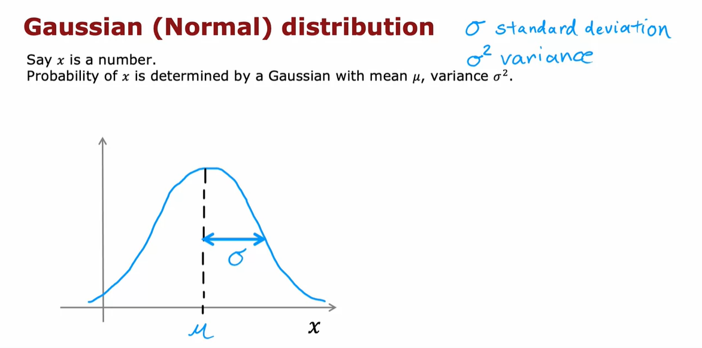
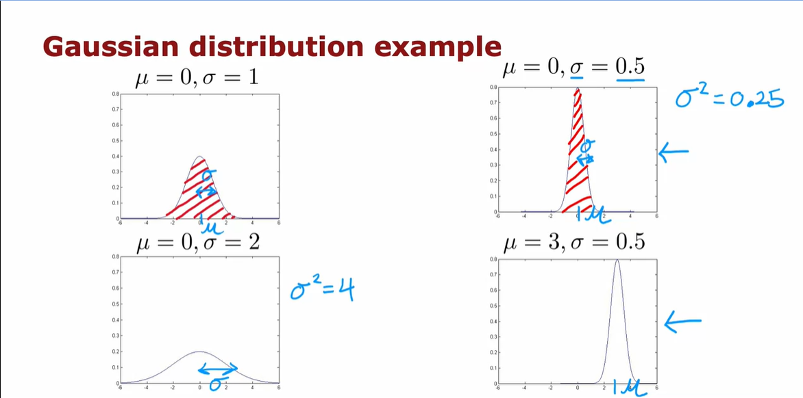
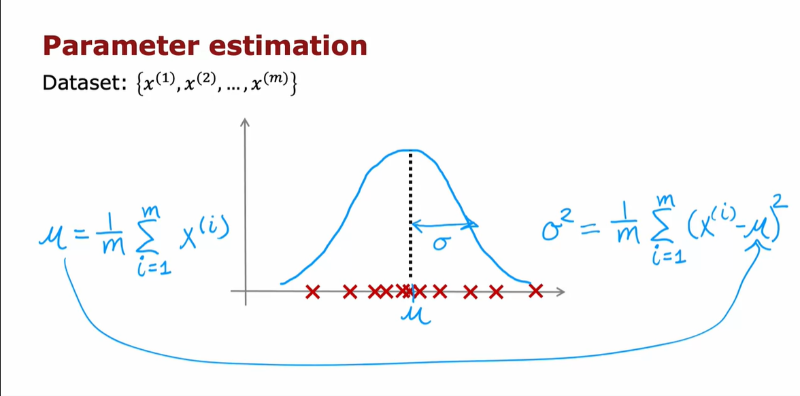

# Gaussian Distribution and Anomaly Detection

## Gaussian Distribution Overview

- **Gaussian Distribution:** Also known as the normal distribution, it is a probability distribution characterized by a bell-shaped curve. The curve is defined by two parameters: mean (Mu) and variance (sigma squared).

- **Probability of x:** The probability of a random variable x following a Gaussian distribution is given by the formula:
  \[ p(x) = \frac{1}{\sqrt{2\pi}\sigma} e^{-(x - \mu)^2/(2\sigma^2)} \]

- **Interpretation:** The probability density function \(p(x)\) represents the likelihood of observing a specific value of x. The bell-shaped curve illustrates the distribution of a large number of samples drawn from this distribution.

## Effect of Changing Mu and Sigma

1. **Standard Gaussian Distribution (Mu = 0, Sigma = 1):**
   - Centered at zero with a standard deviation of one.
   - A common reference for comparison.

2. **Reduced Sigma (Sigma = 0.5):**
   - Thinner curve due to a smaller standard deviation.
   - Taller curve compensates for the reduced width.

3. **Increased Sigma (Sigma = 2):**
   - Wider distribution with a larger standard deviation.
   - Shorter curve to maintain a total area under the curve equal to one.

4. **Change in Mu (Mu = 2, Sigma = 0.5):**
   - Shifts the center of the distribution to the right while maintaining the standard deviation.
   

## Application to Anomaly Detection

- **Anomaly Detection Dataset:** Given a dataset of \(m\) examples with a single feature \(x\), the goal is to estimate parameters Mu and Sigma squared for a Gaussian distribution.

- **Estimation Formulas:**
   - \[ \mu = \frac{1}{m} \sum_{i=1}^{m} x^{(i)} \]
   - \[ \sigma^2 = \frac{1}{m} \sum_{i=1}^{m} (x^{(i)} - \mu)^2 \]
   
- **Maximum Likelihood Estimates:** These formulas provide estimates for Mu and Sigma squared and are technically known as maximum likelihood estimates.

- **Anomaly Decision:** Given an example \(x_{\text{test}}\):
   - If \(p(x_{\text{test}}) < \epsilon\), flag it as an anomaly.
   - If \(p(x_{\text{test}}) \geq \epsilon\), consider it normal.

## Handling Multiple Features

- **Extension to Multiple Features:** In practical applications, there are usually multiple features (\(n\) features).
  
- **Sophisticated Anomaly Detection:**
   - The principles learned from a single Gaussian distribution can be extended to handle multiple features.
   - Calculate Mu and Sigma for each feature independently.

- **Multivariate Gaussian Distribution:** Utilize a multivariate Gaussian distribution to model the joint probability of multiple features. The extension involves using a covariance matrix in addition to Mu and Sigma.

- **Next Steps:** The next pdf will explore the application of Gaussian distribution to more sophisticated anomaly detection algorithms, considering scenarios with multiple features.