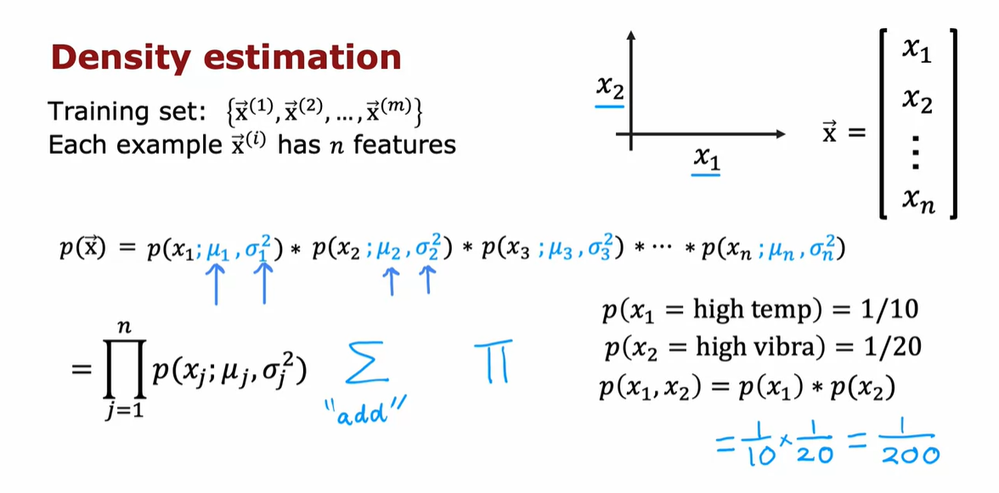
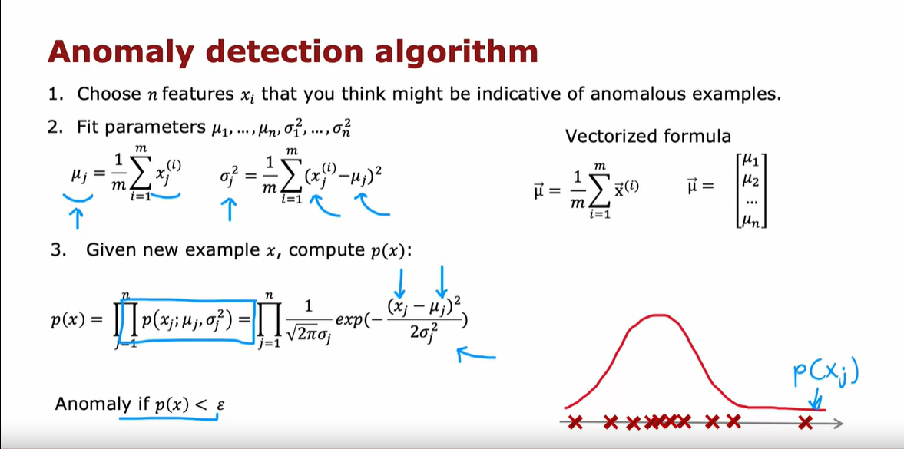
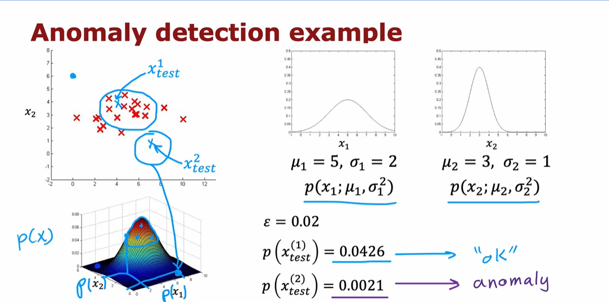

# Anomaly Detection Algorithm: Building and Evaluating

## Overview

In building an anomaly detection algorithm, we aim to identify anomalies in a dataset. The algorithm is based on the Gaussian distribution and involves the following steps:

### Step 1: Choose Features

1. **Training Set (x1 through xm):**
   - Each example \(x\) has \(n\) features.
   - Example: In aircraft engine manufacturing, features could include heat and vibrations.

### Step 2: Density Estimation

2. **Model for \(p(x)\):**
   - Assume features are statistically independent (though the algorithm can work even if they aren't).
   - Probability \(p(x)\) modeled as the product of individual feature probabilities:
     \[ p(x) = \prod_{j=1}^{n} p(x_j) \]

   - Each feature \(x_j\) is modeled by a Gaussian distribution:
     \[ p(x_j) = \frac{1}{\sqrt{2\pi}\sigma_j} e^{-\frac{(x_j - \mu_j)^2}{2\sigma_j^2}} \]
     
### Step 3: Parameter Estimation

3. **Estimate Parameters (\(\mu_j\), \(\sigma_j^2\)):**
   - \(\mu_j\) is the average of feature \(x_j\) over all examples.
   - \(\sigma_j^2\) is the average squared difference between \(x_j\) and \(\mu_j\).

   \[ \mu_j = \frac{1}{m} \sum_{i=1}^{m} x_j^{(i)} \]

   \[ \sigma_j^2 = \frac{1}{m} \sum_{i=1}^{m} (x_j^{(i)} - \mu_j)^2 \]

### Step 4: Anomaly Detection

4. **Decision Rule:**
   - Given a new example \(x_{\text{test}}\):
     - Compute \(p(x_{\text{test}})\) using the product of individual feature probabilities.
     - If \(p(x_{\text{test}}) < \epsilon\), flag as an anomaly.
   
## Parameter Choices

- **Choosing Features:**
   - Select features believed to indicate anomalous behavior.

- **Choosing \(\epsilon\):**
   - \(\epsilon\) is a threshold to determine when an example is flagged as anomalous.
   - Typically chosen based on cross-validation on a labeled validation set.

## Evaluation

- **How to know if the algorithm is working well?**
   - Use labeled data (with anomalies marked) to evaluate algorithm performance.
   - Metrics:
     - True Positive (TP), False Positive (FP), False Negative (FN), True Negative (TN).
     - Precision, Recall, F1 Score.
     - Adjust \(\epsilon\) to balance precision and recall based on application requirements.

### Example Evaluation

- **Parameters:**
   - \( \epsilon = 0.02 \)

- **Test Examples:**
   - \(x_{\text{test}_1}\): \(p(x_{\text{test}_1}) \approx 0.4\) (Not flagged as anomaly)
   - \(x_{\text{test}_2}\): \(p(x_{\text{test}_2}) \approx 0.0021\) (Flagged as anomaly)

- **Conclusion:**
   - Algorithm correctly identifies \(x_{\text{test}_2}\) as an anomaly and ignores \(x_{\text{test}_1}\).
   

## Next Steps

In the next pdf, we'll explore parameter tuning, choosing an appropriate \(\epsilon\), and refining the anomaly detection system for optimal performance.